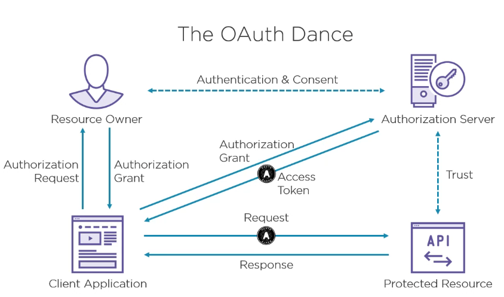
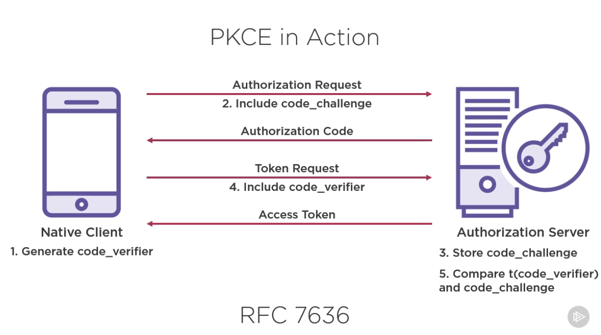
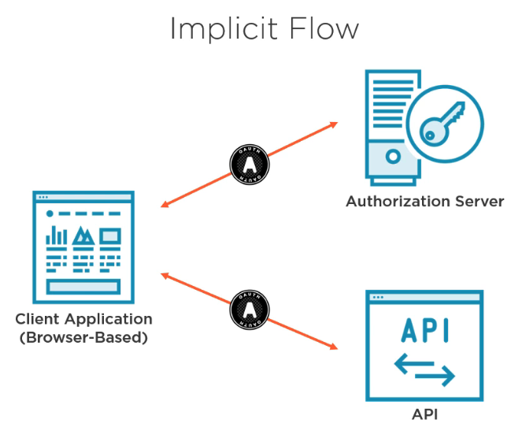
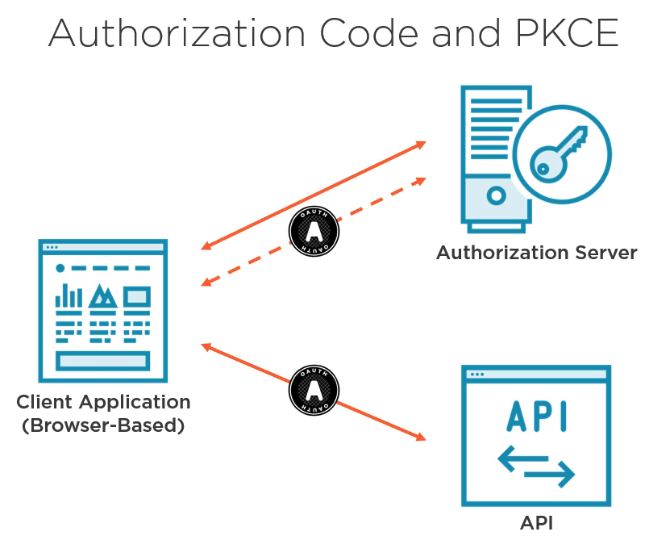
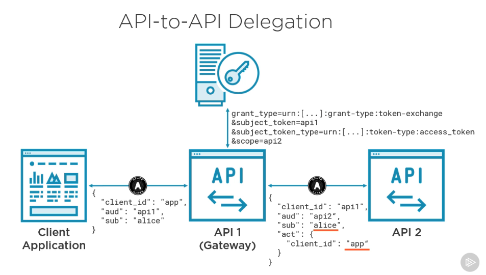

# oauth-2-getting-started

```aiignore
https://app.pluralsight.com/library/courses/oauth-2-getting-started
```

## Oauth 2.0



DELEGATION OVER IMPERSONATION

### Aka Delegation Protocol
Framework to delegate scope access, mostly for http/apis

### 4 Players
Protected resources
  the api

Client
  requesting the api

Resource owners
  user

Auth server

### Oauth != Auth
[not good]
Too abstract, flexibility implementing:
access token format
access token validation
user authentication

[good]
delegated access
api access control
separation of user & client credential
user consent

### Endpoints
Authorization
Token

### Scope
A permission to do something within a protected resource on behalf of the resource owner
granularity:
api or read/write or functionality

### Client Credentials [grant_type]
Client application is the resource owner
machine2machine
access token with lifetime, no manual input to update

```
grant_type: client_credentials
client_id: 
client_secret:
```

### Resource Owner Password Credentials (ROPC) [grant_type]
Temp solution for legacy apps
do not use

### Long Lived Access With Refresh Tokens
Refresh tokens are a long live tokens

### Response Modes
3 modes, Query String - Hash Fragment - Form post

### When Things Go Wrong
error
error_description
error_uri
state
all returned in the 4xx

### OAuth 2.1
no more ROPC
no more implicit
single-use refresh tokens
PKCE across the board
No tokes in the query string

### Native applications
Native apps = public clients
no use of the implicit flow in a mobile device, since tokens will be visible for other apps

### PKCE
can
make secure back channel requests
can't
receive tokens via the browser
keep a secret
SOLUTION -- Proof key for code exchange (PKCE)
links the authorization request to the token request(original)



### Best Redirect URI
Private-use URI scheme
Claimed https scheme
Loopback device

### Browser-based Applications
Meaning code running the browser and SPA
cons:
network calls are visible to user
request replay
no longer secure storage
token left, by malicious code

### OAuth running in the browser
Use the implicit flow



better approach implicit flow + PKCE



DO NOT STORE CREDENTIALS IN THE BROWSER

### Backend for Frontend
Way to go
backend to handle all auth server
backend to proxy to 3 parties

### OpenID Connect
Add magic to OAuth, provides auth to plain OAuth and more
Identity Token, describes the auth event itself, used to validate the info provided
Always JWT
header.payload.signature:
```
header: { "alg": "RS256", "kid": "key-id", "typ": "JWT" },
payload: { ...time info(EPOCH)..., ...nonce(no more than once)..., ...hash..., etc }
```
Also provides the "Hybrid Flow"

### Device Flow
Code + bla bla + streaming apps

### SAML
Service provider -> Auth provider

### Token Exchange (Securing Microservices)
```
One of the newer specifications from the OAuth working group address is a use case commonly seen with microservices and API gateways. In this scenario, a client application has gained an access token so that they can talk to API 1 on behalf of a user. However, API 1 now needs to talk to API 2. How do you secure that? One solution would be for API 1 to simply replay the access token it received from the client application. This would work. However, this access token now needs to be authorized for a scope or multiple scopes that represent both API 1 and API 2, effectively breaking our authorization model at both API 1 and API 2. This also means that if API 2 is publicly accessible or ever becomes so, the client application could bypass API 1 and call API 2 directly, which is something that you may know have architected for. With this technique, API 1 is also impersonating the client application. And as we know from this course and modern security, we prefer delegation over impersonation. Another option would be to have API 1 get its own access token by using the client credentials grant type for machine‑to‑machine communication. By getting a new access token from the authorization server, we remove the potential to bypass API 1 and reestablish our authorization model by having API 1 and API 2 distinguishable from one another. However, we are no longer acting on behalf of the user. API 1 has now become the resource owner, and that has a completely different security profile than the initial user. To make this work, we would have to allow API 1 to access every user's data within API 2 and therefore make it API 1's responsibility to perform user‑level authorization. Checks such as can Alice create new users now takes place within API 1, and API 2 has to trust that this check was performed correctly. This may work for some of your internal APIs, but it's not very scalable. Each time a new API has to talk to API 2, they must replicate these authorization rules. Ideally, these rules should be implemented once and within the resource itself, API 2. Token exchange allows us to do exactly that. With token exchange, API 1 takes the access token it received from the client application and swaps it for a new access token. This new access token will represent the correct requesting application and audience, but it will also maintain both the original requesting user and the client application. Token exchange allows us to maintain our authorization model and keep resource‑level authorization rules within the resource itself. If we take a look at a token exchange request initiated by API 1, we can see that the API is authenticating itself and then requesting access to API 2 by sending the original access token that it received from the client application. Token exchange can be used by swapping any kind of token from a generic OAuth access token to a JSON Web Token, a SAML assertion, or an OpenID Connect identity token.
```


